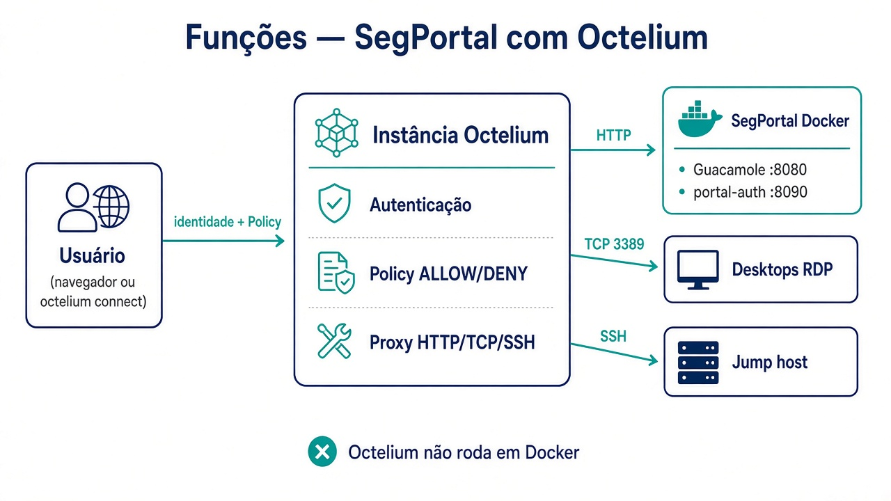
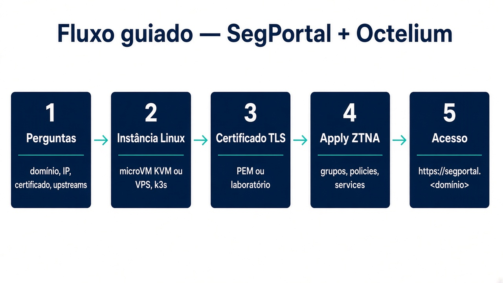

# SegPortal + Octelium (ZTNA)

Fork operacional do [SegPortal](https://github.com/avilarezende/segportal) em que a
fronteira **Zero Trust** deixa de ser o Ingress público e passa a ser um
[Cluster Octelium](https://octelium.com/docs/octelium/latest/overview/quick-install).

O Guacamole, o portal-auth, RDP e SSH continuam como aplicações do SegPortal.
Eles ficam em endereços **privados**; quem chega até eles é o Octelium, depois
de autenticar a identidade e avaliar a Policy.





> ⚠️ **Este repositório é o bundle ZTNA**, não o SegPortal em si. O SegPortal
> (Guacamole, portal-auth, navegador) continua no repositório
> [`avilarezende/segportal`](https://github.com/avilarezende/segportal) e sobe
> com Docker Compose/Kubernetes como sempre. Use a versão **atual** do SegPortal
> (com LDAP real, MFA TOTP e secrets obrigatórias) — não as versões antigas
> embutidas em branches de desenvolvimento.

---

## O que este repositório publica

| Serviço | Modo | Quem acessa | Upstream privado |
|---|---|---|---|
| `segportal` | HTTP público | `segportal-users` e `segportal-admins` | `guacamole.segportal.svc:8080` |
| `portal-auth` | HTTP público | mesmos grupos | `portal-auth.segportal.svc:8090` |
| `desktop-financeiro` | TCP 3389 | mesmos grupos | `tcp://10.10.20.51:3389` |
| `desktop-admin` | TCP 3389 | só `segportal-admins` | `tcp://10.10.20.10:3389` |
| `jump-ssh` | SSH | só `segportal-admins` | `ssh://10.10.20.10:22` |

Arquivos: [`cluster/`](cluster/).

---

## Estrutura

```
segportal-octelium/
├── cluster/                    # Recursos Octelium (Group, User, Policy, Service)
│   ├── groups.yaml
│   ├── users.yaml              # DEMO — use IdentityProvider em produção
│   ├── policies.yaml           # deny-by-default + ALLOW por grupo
│   └── services.yaml           # Serviços publicados (upstreams privados)
├── instance/                   # MicroVM KVM dedicada ao Cluster Octelium
│   ├── create-instance.sh      # QEMU + cloud-init (Ubuntu 24.04)
│   ├── services.yaml.tpl       # Template p/ perfil instance (Compose no host)
│   ├── cloud-init/             # user-data / meta-data
│   └── tools/install-clients.sh
├── scripts/
│   ├── guided.sh               # Instalação guiada (domínio, IP, certificado)
│   └── apply.sh                # Valida e aplica os recursos no Cluster
├── k8s/overlays/octelium/      # Overlay K8s que remove o Ingress público
│   └── networkpolicy.yaml      # Só namespace do Octelium + mesmo namespace
└── docs/images/                # Diagramas
```

---

## Instalação guiada

```bash
./scripts/guided.sh
```

`--yes` responde com as variáveis de ambiente. `--dry-run` só grava
`instance/.local/guided.env`.

## Octelium não roda em Docker

O projeto [não oferece Docker Compose](https://github.com/octelium/octelium/issues/17).
O Cluster sobe em Kubernetes (k3s numa máquina Linux). O SegPortal
(Guacamole, portal-auth, navegador) continua no Compose. O Octelium é **outra
instância**.

```bash
sudo apt-get install -y qemu-system-x86 qemu-utils cloud-image-utils
./instance/tools/install-clients.sh
./instance/create-instance.sh
```

A microVM KVM usa Ubuntu 24.04, systemd e o instalador oficial
(`install-cluster.sh --domain octelium.segportal.local --nat`). SSH no host:
porta `2222`. HTTPS do Cluster: porta `8443`. A VM alcança o Compose em
`http://10.0.2.2:8080` e `:8090`.

Depois do login no Cluster:

```bash
export OCTELIUM_DOMAIN=octelium.segportal.local
export SEGPORTAL_JUMP_HOST_KEY="$(ssh-keyscan -t ed25519 <jump-ssh-host>)"
./scripts/apply.sh --profile instance
```

`--profile cluster` (padrão) publica os upstreams `*.segportal.svc.cluster.local`,
para quando a aplicação também está no Kubernetes do Octelium.

## Aplicar o ZTNA do SegPortal

```bash
chmod +x scripts/apply.sh
./scripts/apply.sh
```

Sem `octeliumctl`, o script só valida o YAML. Variáveis relevantes:

| Variável | Obrigatória | Descrição |
|---|---|---|
| `SEGPORTAL_JUMP_HOST_KEY` | **sim** (produção) | Host key pública do `jump-ssh` (obtenha com `ssh-keyscan -t ed25519 <host>`) |
| `SEGPORTAL_ALLOW_INSECURE_SSH` | não (`0`) | `1` = permite `insecureIgnoreHostKey` (laboratório APENAS) |
| `SEGPORTAL_UPSTREAM_HOST` | não (`10.0.2.2`) | IP do SegPortal visto pela instância |
| `SEGPORTAL_GUACAMOLE_PORT` / `SEGPORTAL_PORTAL_PORT` | não (`8080`/`8090`) | Portas do Compose |
| `SEGPORTAL_DESKTOP_FINANCEIRO` / `SEGPORTAL_DESKTOP_ADMIN` / `SEGPORTAL_JUMP_HOST` | não | IPs dos hosts RDP/SSH |

## Subir a aplicação sem Ingress público

```bash
kubectl apply -k k8s/overlays/octelium
```

Esse overlay remove o Ingress `segportal` e aplica uma NetworkPolicy: só pods do
namespace `octelium` e do próprio `segportal` entram nos workloads.

## Como o usuário entra

HTTP (navegador, sem cliente VPN):

- `https://segportal.<domínio-do-cluster>`
- `https://portal-auth.<domínio-do-cluster>`

O portal de autenticação do Octelium pede a identidade antes de encaminhar ao upstream.

TCP e SSH:

```bash
octelium connect -p desktop-financeiro:3389
octelium connect -p jump-ssh:22
ssh -p 22 segportal@127.0.0.1
```

## Identidade corporativa

**Não use os usuários demo fora do laboratório** (`cluster/users.yaml`). Crie um
IdentityProvider OpenID Connect ou SAML 2.0 apontando para o Active Directory e
faça o `email` / `identifier` do User coincidir com a conta. Referência:
[Users](https://octelium.com/docs/octelium/latest/management/core/user).

Hosts RDP/SSH atrás de NAT podem ser publicados por um cliente
`octelium connect --serve` em vez de URL fixa.

## Segurança (hardening aplicado neste fork)

- **Host key do `jump-ssh` obrigatória** — o YAML usa `upstreamHostKeyValue`
  (placeholder), nunca `insecureIgnoreHostKey` por padrão. O `apply.sh` recusa
  aplicar se a host key não for fornecida (fail-closed).
- **TLS**: `install-cluster.sh` usa certificado (modo 2 — PEM) por padrão no
  `guided.sh`; `OCTELIUM_INSECURE_TLS` é só para laboratório explícito.
- **Menos flags de laboratório por padrão**: `OCTELIUM_FORCE_MACHINE_IP` e
  `SEGPORTAL_ALLOW_INSECURE_SSH` passam a ser `n` por padrão.
- **Sem credenciais reais**: usuários demo usam `@seu-dominio.exemplo`.
- **`apply.sh` não altera arquivos versionados**: perfil `cluster` trabalha numa
  cópia temporária (o placeholder `__JUMP_HOST_KEY__` permanece no repositório).

## Referências

- [SegPortal (aplicação)](https://github.com/avilarezende/segportal)
- [Quick install — Octelium](https://octelium.com/docs/octelium/latest/overview/quick-install)
- [HTTP Services — Octelium](https://octelium.com/docs/octelium/latest/management/core/service/http)
- [Policies — Octelium](https://octelium.com/docs/octelium/latest/management/core/policy)
- [SECURITY.md do SegPortal](https://github.com/avilarezende/segportal/blob/main/docs/SECURITY.md)

## Licença

Mesma do SegPortal — MIT (ver `LICENSE` no repositório upstream).